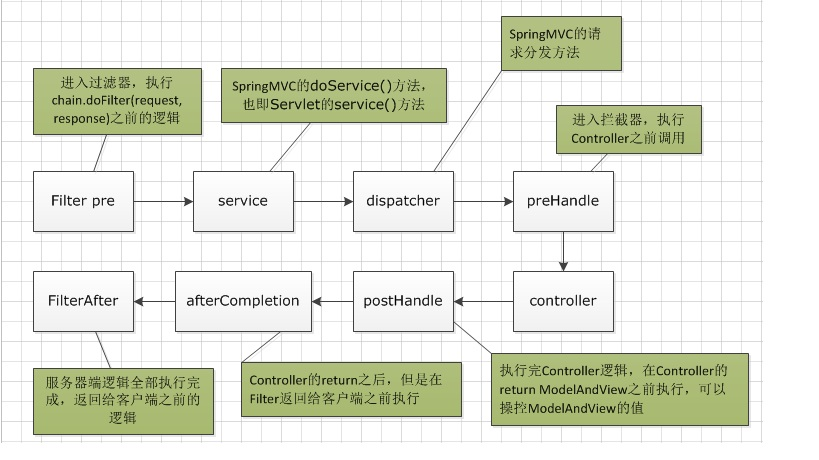

# Filter, Interceptor, Listener

## 几种组件的介绍

### 过滤器Filter

Filter 对 **用户请求** 进行 **预处理**，接着将请求交给 `Servlet` 进行 **处理** 并 **生成响应**，最后 Filter 再对 **服务器响应** 进行 **后处理**。Filter 是可以复用的代码片段，常用来转换 `HTTP` 请求、响应 和 头信息。Filter 不像 Servlet，它不能产生 **响应**，而是只 **修改** 对某一资源的 请求 或者 响应。

Filter随web应用的启动而启动，只初始化一次，随web应用的停止而销毁。
1. 启动服务器时加载过滤器的实例，并调用 `init()` 方法来初始化实例；
2. 每一次请求时都只调用方法 `doFilter()` 进行处理；
3. 停止服务器时调用 `destroy()` 方法，销毁实例。

### 拦截器Interceptor

类似 **面向切面编程** 中的 **切面** 和 **通知**，我们 通过 **动态代理** 对一个 `service()` 方法添加 **通知** 进行功能增强。比如说在方法执行前进行 **初始化处理**，在方法执行后进行 **后置处理**。**拦截器** 的思想和 **AOP** 类似，区别就是 **拦截器** 只能对 **Controller** 的 **HTTP** 请求进行拦截。

spring mvc中的Interceptor可以理解为是Spring MVC框架对AOP的一种实现方式。

一般简单的功能又是通用的,每个请求都要去处理的,比如判断token是否失效可以使用spring mvc的HanlderInterceptor。

 复杂的,比如缓存,需要高度自定义的就用spring aop。
 
 一般来说service层更多用spring aop，controller层有必要用到request和response的时候，可以用拦截器。

 HandlerInterceptor接口中定义了**三个方法** preHandle, postHandle, 和afterCompletion：

* **preHandle**：预处理回调方法，实现处理器的预处理（如登录检查），返回值：true表示继续流程（如调用下一个拦截器或处理器），false表示流程中断（如登录检查失败），不会继续调用其他的拦截器或处理器，此时我们需要通过response来产生响应。
* **postHandle**：后处理回调方法，实现处理器的后处理（但在渲染视图之前），此时我们可以通过 modelAndView（模型和视图对象）对模型数据进行处理或对视图进行处理，modelAndView也可能为null。
* **afterCompletion**：整个请求处理完毕回调方法，即在视图渲染完毕时回调。该方法也是需要当前对应的Interceptor 的preHandle方法的返回值为true时才会执行。这个方法的主要作用是用于进行资源清理工作的，如性能监控中我们可以在此记录结束时间并输出消耗时间。

### 监听器Listener

Listener 可以监听 web 服务器中某一个 **事件操作**，并触发注册的 **回调函数**。通俗的语言就是在 application，session，request 三个对象 **创建/消亡** 或者 **增删改** 属性时，自动执行代码的功能组件。

### Servlet

Servlet 是一种运行 **服务器端** 的 java 应用程序，具有 **独立于平台和协议** 的特性，并且可以动态的生成 `web` 页面，它工作在 **客户端请求** 与 **服务器响应** 的中间层。

## 过滤器 VS 拦截器

### 两者的区别

* Filter 是基于 **函数回调**的，而 Interceptor 则是基于 Java **反射** 和 **动态代理**。
* Filter 依赖于 `Servlet` 容器，而 Interceptor 不依赖于 `Servlet` 容器。
* Filter 对几乎 **所有的请求** 起作用，而 Interceptor 只对 `Controller` 对请求起作用。
* Filter 只能在容器初始化时被调用一次，而 Interceptor 可以多次被调用。

### 执行顺序

对于自定义 Servlet 对请求分发流程：

1. Filter 过滤请求处理；
2. Servlet 处理请求；
3. Filter 过滤响应处理。

对于自定义 Controller 的请求分发流程：

1. Filter 过滤请求处理；
2. Interceptor 拦截请求处理；
3. 对应的 HandlerAdapter 处理请求；
4. Interceptor 拦截响应处理；
5. Interceptor 的最终处理；
6. Filter 过滤响应处理。

---

推荐阅读：

[Servlet Filter和Spring mvc Interceptor](https://www.jianshu.com/p/685c65ed6944)

[实战Spring Boot 2.0系列(五) - Listener, Servlet, Filter和Interceptor](https://juejin.im/post/5b2ddbcef265da59a76c92a4)