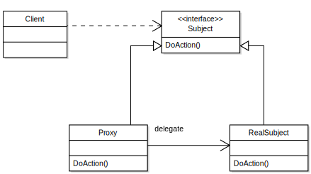

# 设计模式-Proxy模式

## 主要作用
通过引入**代理对象**，来间接访问**目标对象**。



## 样例
给一个[java-design-patterns](https://github.com/iluwatar/java-design-patterns/tree/master/proxy)的样例：

先定义一个 WizardTower 接口，和一个实现了此接口的 IvoryTower 类，WizardTower 就是我们的被代理对象，IvoryTower 是被代理对象的实际实现。
```Java
public interface WizardTower {

  void enter(Wizard wizard);
}

public class IvoryTower implements WizardTower {

  private static final Logger LOGGER = LoggerFactory.getLogger(IvoryTower.class);

  public void enter(Wizard wizard) {
    LOGGER.info("{} enters the tower.", wizard);
  }

}
```
定义一个 Wizard 类，作为实体类
```Java
public class Wizard {

  private final String name;

  public Wizard(String name) {
    this.name = name;
  }

  @Override
  public String toString() {
    return name;
  }
}
```
接下来是我们实现了 WizardTower 接口的代理类，实现对 WizardTower 的访问控制。
在这里我们设置了只有三名法师能进入法师塔。
```Java
public class WizardTowerProxy implements WizardTower {

  private static final Logger LOGGER = LoggerFactory.getLogger(WizardTowerProxy.class);

  private static final int NUM_WIZARDS_ALLOWED = 3;

  private int numWizards;

  private final WizardTower tower;

  public WizardTowerProxy(WizardTower tower) {
    this.tower = tower;
  }

  @Override
  public void enter(Wizard wizard) {
    if (numWizards < NUM_WIZARDS_ALLOWED) {
      tower.enter(wizard);
      numWizards++;
    } else {
      LOGGER.info("{} is not allowed to enter!", wizard);
    }
  }
}
```
来一个小测试，成功实现了对 WizardTower 的代理
```Java
WizardTowerProxy proxy = new WizardTowerProxy(new IvoryTower());
proxy.enter(new Wizard("Red wizard")); // Red wizard enters the tower.
proxy.enter(new Wizard("White wizard")); // White wizard enters the tower.
proxy.enter(new Wizard("Black wizard")); // Black wizard enters the tower.
proxy.enter(new Wizard("Green wizard")); // Green wizard is not allowed to enter!
proxy.enter(new Wizard("Brown wizard")); // Brown wizard is not allowed to enter!
```

注意，代理类和被代理对象通常是组合关系，即被代理对象不存在，代理类也没有存在的意义。

## 典型应用

* Control access to another object（对象的访问控制）
* Lazy initialization（延迟初始化）
* Implement logging（实现日志记录）
* Facilitate network connection（促进网络链接）
* Count references to an object（对象引用的计数）

---
[java-design-patterns](https://github.com/iluwatar/java-design-patterns/tree/master/proxy)