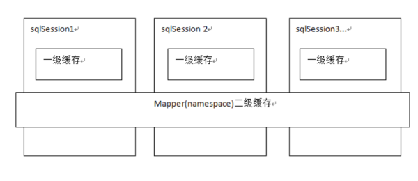
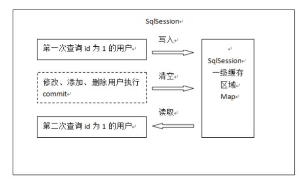
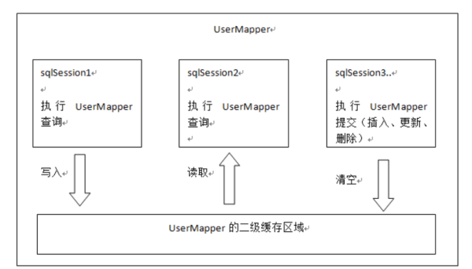

# Mybtais

## 查询缓存

mybatis提供查询缓存，用于减轻数据压力，提高数据库性能。

如果缓存中有数据就不用从数据库中获取，大大提高系统性能。

mybaits提供一级缓存，和二级缓存。



一级缓存是**SqlSession级别**的缓存。在操作数据库时需要构造 sqlSession对象，在对象中有一个数据结构（HashMap）用于存储缓存数据。不同的sqlSession之间的缓存数据区域（HashMap）是互相不影响的。存入HashMap，每次需要用到时查询该SqlSession是否已经存在。

二级缓存是**mapper级别**的缓存，多个SqlSession去操作同一个Mapper的sql语句，多个SqlSession可以共用二级缓存，二级缓存是跨SqlSession的。

### 一级缓存



第一次发起查询用户id为1的用户信息，先去找缓存中是否有id为1的用户信息，如果没有，从数据库查询用户信息。

得到用户信息，将用户信息存储到一级缓存中。

如果sqlSession去执行commit操作（执行插入、更新、删除），清空SqlSession中的一级缓存，这样做的目的为了让缓存中存储的是最新的信息，避免脏读。

第二次发起查询用户id为1的用户信息，先去找缓存中是否有id为1的用户信息，缓存中有，直接从缓存中获取用户信息。

mybatis默认支持一级缓存，不需要在配置文件去配置。

#### 一级缓存应用

正式开发，是将mybatis和spring进行整合开发，事务控制在service中。

一个service方法中包括 很多mapper方法调用。
```
service{
//开始执行时，开启事务，创建SqlSession对象
//第一次调用mapper的方法findUserById(1)
//第二次调用mapper的方法findUserById(1)，从一级缓存中取数据
//方法结束，sqlSession关闭
}
```

如果是**执行两次service**调用查询相同 的用户信息，不走一级缓存，因为session方法结束，sqlSession就关闭，一级缓存就清空。

### 二级缓存



首先开启mybatis的二级缓存。

sqlSession1去查询用户id为1的用户信息，查询到用户信息会将查询数据存储到二级缓存中。

如果SqlSession3去执行**相同 mapper** 下sql，执行commit提交，清空该 mapper下的二级缓存区域的数据。

sqlSession2去查询用户id为1的用户信息，去缓存中找是否存在数据，如果存在直接从缓存中取出数据。

二级缓存与一级缓存区别，二级缓存的范围更大，多个sqlSession可以共享一个UserMapper的二级缓存区域。

UserMapper有一个二级缓存区域（按namespace分） ，其它mapper也有自己的二级缓存区域（按namespace分）。

每一个namespace的mapper都有一个二缓存区域，两个mapper的namespace如果相同，这两个mapper执行sql查询到数据将存在相同 的二级缓存区域中。

####  二级缓存应用场景

对于访问多的查询请求且用户对查询结果实时性要求不高，此时可采用mybatis二级缓存技术**降低数据库访问量，提高访问速度**，业务场景比如：耗时较高的统计分析sql、电话账单查询sql等。

实现方法如下：通过设置刷新间隔时间，由mybatis每隔一段时间自动清空缓存，根据数据变化频率设置缓存刷新间隔flushInterval，比如设置为30分钟、60分钟、24小时等，根据需求而定。

#### 二级缓存局限性

mybatis二级缓存**对细粒度的数据级别的缓存实现不好**，比如如下需求：对商品信息进行缓存，由于商品信息查询访问量大，但是要求用户每次都能查询最新的商品信息，此时如果使用mybatis的二级缓存就无法实现当一个商品变化时只刷新该商品的缓存信息而不刷新其它商品的信息，因为mybaits的二级缓存区域以mapper为单位划分，当一个商品信息变化会将所有商品信息的缓存数据全部清空。解决此类问题需要在业务层根据需求对数据有针对性缓存。

---
推荐阅读：

[Mybatis7:查询缓存](https://zhuanlan.zhihu.com/p/29045286)

[mybatis-spring-boot-autoconfigure
](http://www.mybatis.org/spring-boot-starter/mybatis-spring-boot-autoconfigure/)

[mybatis Java API](http://www.mybatis.org/mybatis-3/zh/java-api.html)
