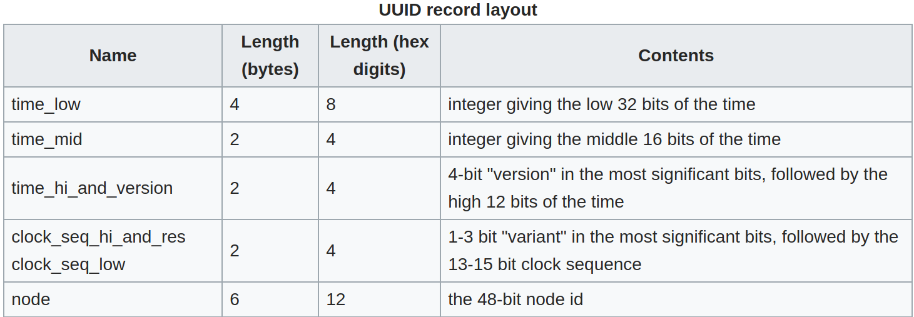

# UUID的使用

一个学习项目中使用UUID，用来生成user的cookie和秒杀地址，为什么要用uuid呢，因为uuid可以认为具有唯一性。
但好像回答有些不全面，现在来充分学习一些uuid

## UUID基本概念

UUID全称：Universally Unique Identifier，即通用唯一识别码。

### 目的

让分布式系统中的所有元素，都能有唯一的辨识信息，而不需要通过中央控制端来做辨识信息的指定。

### 格式

UUID是16字节128位长的数字，通常用36个字符的字符串表示。标准的UUID格式如下：

`123e4567-e89b-12d3-a456-426655440000`

`xxxxxxxx-xxxx-Mxxx-Nxxx-xxxxxxxxxxxx`

除`-`外，上面每个字符都是一个十六进制的数字，共有5个部分组成，第一部分8个，第二部分4个，第三部分4个，第四部分4个，第五部分12个，8-4-4-4-12，一共32个十六进制字符，因此一共是128位。

其中，M表示UUID的版本，N表示UUID的变体。



### 版本

1. **time-based 基于时间的UUID(版本 1)**

    通过计算当前时间戳、随机数和机器MAC地址得到。由于有MAC地址，这个可以保证其在全球的唯一性。但是使用了MAC地址，就会有MAC地址暴露问题。若是局域网，可以用IP地址代替。

2. **DCE Security DCE安全的UUID(版本 2)**

    DCE（Distributed Computing Environment）安全的UUID和基于时间的UUID算法相同，但会把时间戳的前4位置换为POSIX的UID或GID。这个版本的UUID在实际中较少用到。

3. **name-based 基于名字的UUID（MD5）(版本 3)**

    基于名字的UUID通过计算名字和名字空间的MD5散列值得到。这个版本的UUID保证了：相同名字空间中不同名字生成的UUID的唯一性；不同名字空间中的UUID的唯一性；相同名字空间中相同名字的UUID重复生成是相同的。

4. **randomly generated UUID 随机UUID(版本 4)**

    根据随机数，或者伪随机数生成UUID。这种UUID产生重复的概率是可以计算出来的，但随机的东西就像是买彩票：你指望它发财是不可能的，但狗屎运通常会在不经意中到来。

5. **name-based 基于名字的UUID（SHA1）(版本 5)**

    和版本3的UUID算法类似，只是散列值计算使用SHA1（Secure Hash Algorithm 1）算法。

**针对不同的应用，我们可以选择不同的UUID的版本**。

JavaUUID提供了版本3、版本4的生成。

### 变体

* **0xxx （Reserved for NCS backward compatibility）预留**，为向后兼容
* **10xx （Leach-Salz**）当前正在使用的
* **110x （Reserved, Microsoft Corporation backward compatibility**）微软早起GUID预留
* **111x （Reserved for future definition**）将来扩展预留，目前还没被使用

### 用途

* 文件名随机
* 网页session Id
* 数据库表主键
* 事务id

以上用途皆利用UUID的唯一性。

下面给一个简单的实现：

```Java
/**
 * 生成随机UUID
 */
public class UUIDUtil {
    public static String uuid() {
        return UUID.randomUUID().toString().replace("-", "");
    }
}
```

## 源码

我们从**randomUUID**()方法开始

```Java
public static UUID randomUUID() {
    //伪随机数生成器
    SecureRandom ng = Holder.numberGenerator;
    
    byte[] randomBytes = new byte[16];
    //生成16字节的伪随机数
    ng.nextBytes(randomBytes);
    //第7个字节的高4位全部变0，低4位不变
    randomBytes[6]  &= 0x0f;
    //第7个字节的高4位变0100，低4位不变，也就是设置版本号为4
    randomBytes[6]  |= 0x40;
    //下面两步跟上面差不多，就是把变体所在字节变10xx，也就是变体2
    randomBytes[8]  &= 0x3f;  
    randomBytes[8]  |= 0x80; 
    //然后调用私有构造器生成
    return new UUID(randomBytes);
}
```

接下来看一下所调用的私有构造器

```Java
private UUID(byte[] data) {
    long msb = 0;
    long lsb = 0;
    assert data.length == 16 : "data must be 16 bytes in length";
    // msb << 8 | data[i] 每次左移8位并取或运算 
    // 循环八次之后msb即为64位
    for (int i=0; i<8; i++)
        msb = (msb << 8) | (data[i] & 0xff);
    //同上
    for (int i=8; i<16; i++)
        lsb = (lsb << 8) | (data[i] & 0xff);
    this.mostSigBits = msb;
    this.leastSigBits = lsb;
}
```

接下来我们需要调用toString来生成字符串，看一下UUID对toString的实现

```Java
public String toString() {
    return (digits(mostSigBits >> 32, 8) + "-" +
            digits(mostSigBits >> 16, 4) + "-" +
            digits(mostSigBits, 4) + "-" +
            digits(leastSigBits >> 48, 4) + "-" +
            digits(leastSigBits, 12));
}
```

toString中调用了digits

```Java
private static String digits(long val, int digits) {
    long hi = 1L << (digits * 4);
    return Long.toHexString(hi | (val & (hi - 1))).substring(1);
}
```

---

引用&推荐阅读

[Java源码分析-UUID](https://www.cnblogs.com/yy1024/p/8034198.html)

[Universally unique identifier](https://en.wikipedia.org/wiki/Universally_unique_identifier#Version_4_(random))