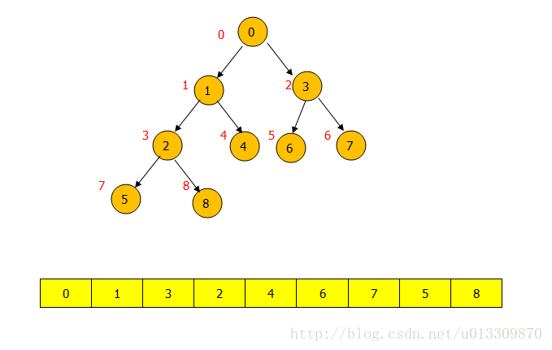

# 堆及其排序



如上图：表示的是最小堆结构，形式上是一棵完全二叉树，实际存储在内存中的是一个数组，也就是对应下面的数组。树中每一个节点左边红色的值，代表它们在数组中的位置。

## 堆中节点的关系

父节点与当前节点的下标对应关系为：当前节点下标为 I 则父节点的下标为（ I - 1）/2 = Parent ， 左孩子节点的下标为：2 * I+1= Lchild ,右节点的下标为：2 * I+2= Rchild 。

## 插入堆

每一个插入的节点放在树的最后一个位置，与其父节点比较，如果比父节点小交换位置，继续与其父节点比较直到比父节点大，或者到了头节点位置停止比较。 

```Java
public void inSertMinHeap(int arr[],int i)
    {                   
           int parent=(i-1)/2;
            while(parent>=0&&arr[i]<arr[parent])
            {
            //如果父节点的下标大于0、并且当前节点小于父节点交换位置。继续向上比较，否则停止比较。
                if(i==0)
                    break;
                int temp=arr[parent];
                arr[parent]=arr[i];
                arr[i]=temp;
                i=parent;
                parent=(i-1)/2;
            }               
    }
```

## 调整堆

删除元素后要对堆进行调整：

堆中每次删除只能删除头节点。也就是数组中的第一个节点。

然后将最后一个节点替代头节点然后进行调整。 

如果左右节点中的最小节点比当前节点小就与左右节点的最小节点交换。直到当前节点无子节点，或者当前节点比左右节点小时停止交换。

```Java
public void heapify(int arr[],int i)
    {       
        int l=2*i+1;
        int r=2*i+2;
        int lestgest=i;
        //用于保存最小节点的下标
        while(l<arr.length)
        {
            if(arr[l]<arr[lestgest])
            {
                lestgest=l;
            }
            if(r<arr.length&&arr[r]<arr[lestgest])
            {
                lestgest=r;
            }
            int temp=arr[i];
            arr[i]=arr[lestgest];           
            arr[lestgest]=temp;
            if(i==lestgest)
                break;
            i=lestgest;
            l=2*i+1;
            r=2*i+2;
        }
    }
```

## 堆排序

堆排序分为三个过程：

①建堆：对数组建堆可以采用从插入堆的方法，从头结点开始不断的进行插入堆。也可以使用堆化的方法从最后节点的父节点开始进行从下往上进行堆化。

②堆排序：每次选择堆顶元素，并将堆顶元素删除，调整堆后，再重复操作直至堆为空。

```Java
public class MyHeapSort {

    public static void main(String[] args) {
        int array[]={1,5,7,3,2,9,4};
        myHeapSort(array);
        System.out.println(Arrays.toString(array));
    }
    public static void myHeapSort(int array[])
    {
        BuildHeap(array);
        //先建立小根堆，使得第一个元素是最小值
        for(int i=array.length-1;i>=0;i--)
        {
            int temp=array[0];
            array[0]=array[i];
            array[i]=temp;
            //数组的第一个元素与后面的元素交换，因为第一个元素总是当前堆的最小元素
            //注意在排序的时候堆是在减小的
            Heapify(array,i,0);
            //交换掉第一个元素后，要对堆进行调整，保证第一个元素仍是最小值
        }
    }
    //使用调整堆从底往上进行建堆
    public static void BuildHeap(int array[])
    {
        for(int i=array.length/2;i>=0;i--)
        {
            Heapify(array,array.length,i);
            //建立堆的过程就是完全二叉树，从下到上调整堆的过程，i=array.length/2开始
            //依次向上调整，i=array.length/2是最后一个节点的父节点i=0是第一个节点
        }
    }
    //使用插入堆的方法从上往下进行建堆
    public static void BuildHeap(int array[]){
        for(int i=0;i<array.length;i++)
        {
            inSertMinHeap(array,i);
         }
    }

}
```

---

转自 ：[堆排序HeapSort（Java）](https://blog.csdn.net/u013309870/article/details/68578011)

文中有更详细的图文过程。