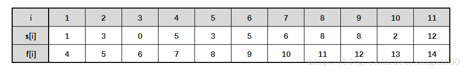

# 活动安排问题-贪心算法

有若干个活动，第i个开始时间和结束时间是[Si,fi)，只有一个活动场地可以利用，活动之间不能交叠，求最多安排多少个活动？



## 问题分析

> 活动安排问题就是要在所给的活动集合中选出最大的相容活动子集合，是可以用贪心算法有效求解的很好例子。该问题要求高效地安排一系列争用某一公共资源的活动。贪心算法提供了一个简单、漂亮的方法使得尽可能多的活动能兼容地使用公共资源。
>
> 活动1 的开始时间s(1)=1，结束时间f(1)=4，它与活动2 是不兼容的。因为，活动1 还没有结束，活动2 就开始了(s(2) < f(1))。
>
> 活动2 与 活动4 是兼容的。因为，活动2的进行区间是[3,5) 而活动4的进行区间是[5,7)
>
> 目标是：在N个活动中，找出最大兼容的活动个数。
>
> 贪心算法在对问题求解时，总是做出在当前看来是最好的选择。也就是说，不从整体最优上加以考虑，他所做出的仅是在某种意义上的局部最优解。贪心算法不是对所有问题都能得到整体最优解，但对范围相当广泛的许多问题他能产生整体最优解或者是整体最优解的近似解。
>
> 虽然贪心算法并不总能求得问题的整体最优解。但对于活动安排问题，贪心算法greedySelector却总能求得整体最优解，即它最终所确定的相容活动集合的规模最大。这个结论可以用数学归纳法证明。
> 
> 贪心算法greedySelector一开始选择活动1 ，并将j初始化为1。然后依次检查活动i是否与当前已选择的所有活动相容。若相容则将活动i加入已选择活动的集合中；否则，不选择活动i，而继续检查下一活动与集合中活动的相容性。由于fi总是当前集合中所有活动的最大结束时间，故活动i与当前集合中所有活动相容的充分且必要条件是其开始时间si不早于最近加入集合的活动j的结束时间fi，即 si>=fj。若活动i与之相容，则i成为最近加入集合中的活动，并取代活动j的位置。由于输入的活动以其完成时间的非减序列排列，所以算法 greedySelector每次总是选择具有最早完成时间的相容活动加入集合中。
>
> 直观上，按这种方法选择相容活动为未安排活动留下尽可能多的时间。也就是说，该算法的贪心选择的意义是使剩余的可安排时间段极大化，以便安排尽可能多的相容活动。

## 算法实现

两个数组，开始时间和结束时间是一一对应的。

这里注意，这里活动的结束时间序列，是从小到大排好序的。

```Java
public class ActivitiesDemo {

    /*
     * 贪心算法求解活动安排问题
     * 设有n个活动的集合E={1,2,…,n}，其中每个活动都要求使用同一资源，
     * 如会议室使用，安排演讲会场等等，而在同一时间内只有一个活动能使用这一资源。
     * 每个活动i都有一个要求使用该资源的起始时间si和一个结束时间fi,且si <fi 。
     * 如果选择了活动i，则它在半开时间区间[si, fi)内占用资源。
     * 若区间[si, fi)与区间[sj, fj)不相交，则称活动i与活动j是相容的。
     * 也就是说，当si≥fj或sj≥fi时，活动i与活动j相容。  
     * 
     * 在下面所给出的解活动安排问题的贪心算法选择函数greedySelector。
     * 
     * 说明：由于输入的活动以其完成时间的非减序排列，所以算法greedySelector
     * 每次总是选择具有最早完成时间的相容活动加入集合A中。
     * 直观上，按这种方法选择相容活动为未安排活动留下尽可能多的时间。
     * 也就是说，该算法的贪心选择的意义是使剩余的可安排时间段极大化，以便安排尽可能多的相容活动。
     * 算法greedySelector的效率极高。当输入的活动已按结束时间的非减序排列，
     * 算法只需O(n)的时间安排n个活动，使最多的活动能相容地使用公共资源。
     * 如果所给出的活动未按非减序排列，可以用O(nlogn)的时间重排（随机快排）。
     * 
     * */

    public static int greedySelector(int[] s, int[] f, boolean[] a) {

        int n = s.length - 1;
        //安排第一个活动，标记为true
        a[1] = true;
        int j = 1;
        int count = 1;

        for (int i = 2; i <= n; i++) {
            //检验当前最早结束的活动的开始时间是否晚于前一个活动的结束结束时间
            if (s[i] >= f[j]) {
                //如果晚于，则表示两个活动相互兼容，将活动标记为true
                a[i] = true;
                j = i;
                //记已经安排活动的个数
                count++;
            } else {
                //与已安排活动不兼容，标记此活动未安排
                a[i] = false;
            }

        }
        return count;

    }

    public static void main(String[] args) {
        // TODO Auto-generated method stub
        //初始化数据s数组记录活动开始时间；f数组记录活动结束时间
        int[] s = { 1, 3, 0, 5, 3, 5, 6, 8, 8, 2, 12 };
        int[] f = { 4, 5, 6, 7, 8, 9, 10, 11, 12, 13, 14 };
        //声明一个boolean型数组
        boolean[] a = new boolean[s.length];

        int result = greedySelector(s, f, a);
        System.out.println("Result is: " + result);
        for (int i = 1; i <= s.length - 1; i++) {
            if (a[i]) {
                System.out.println("第" + i + "活动被选中，其开始时间为：" + s[i] + "，结束时间为：" + f[i]);
            }
        }

    }

}
```

## 若结束时间没有排好序，那么先要进行排序

这种两个数组一一对应的情况，如何对一个数组排序，而对另一个数组产生相应的变化呢？

### 方法一

自己写一个排序算法，我们在排序时，只针对其中一个数组，进行大小比较。但在换位置时，两个数组都由排序时的index进行交换。

### 方法二

因为两个数组一一对应，那我们完全可以写一个类。类中包含这两个域，然后重写一个Comparator，接着就可以对由这个类组成的数组进行排序。